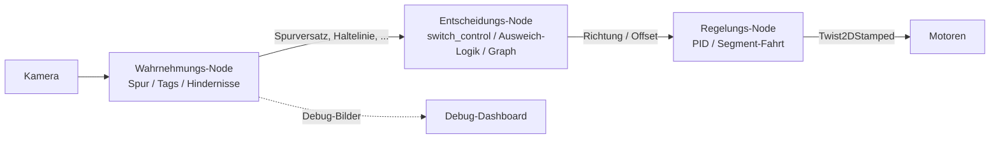
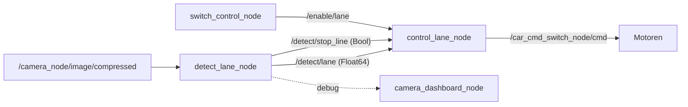
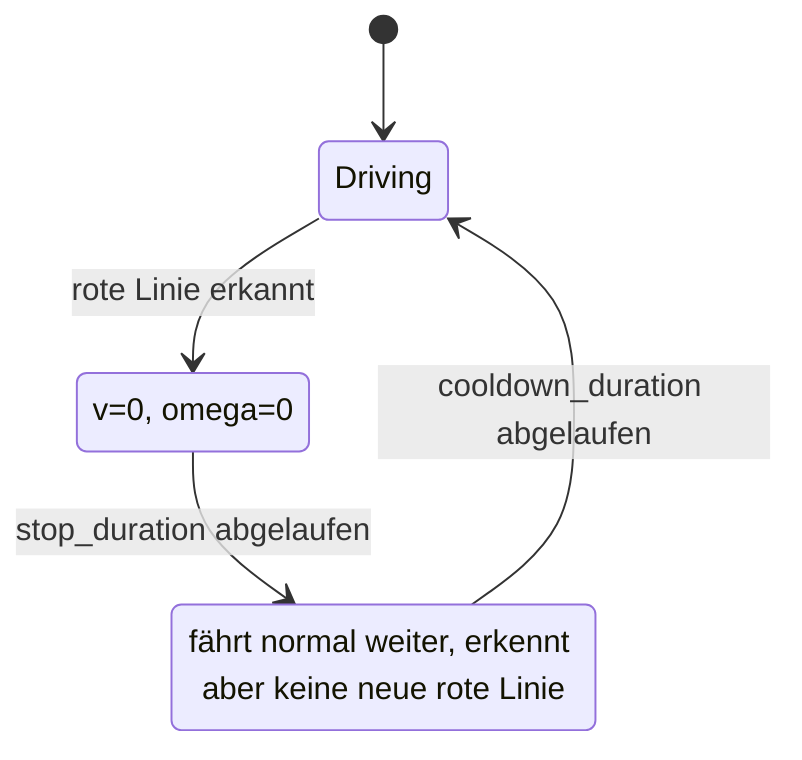
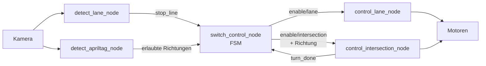
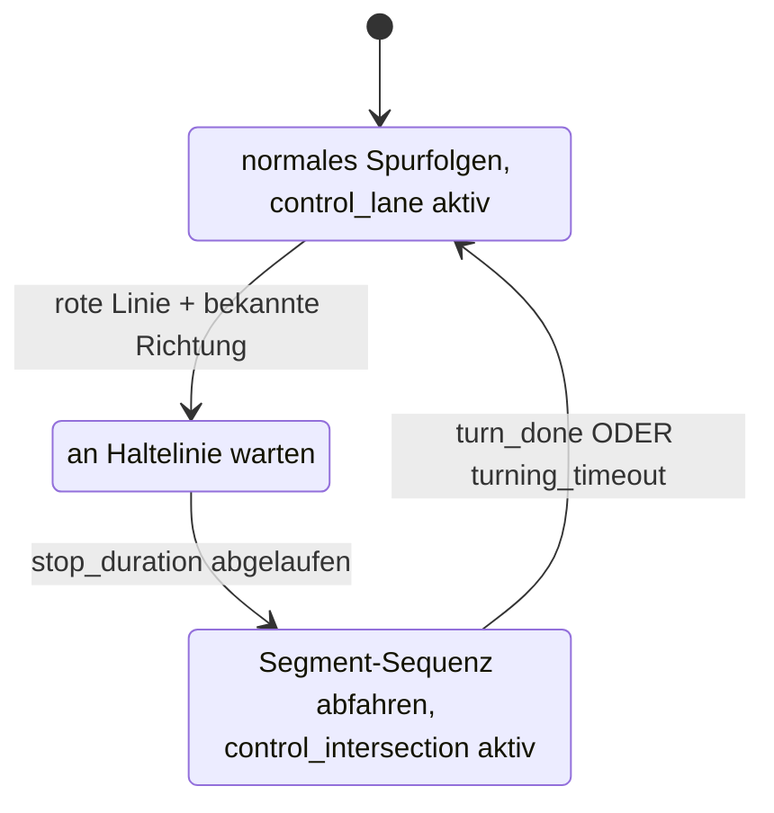
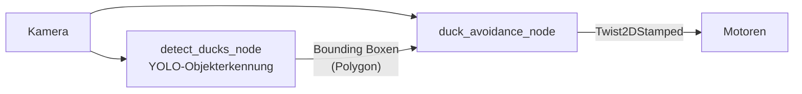
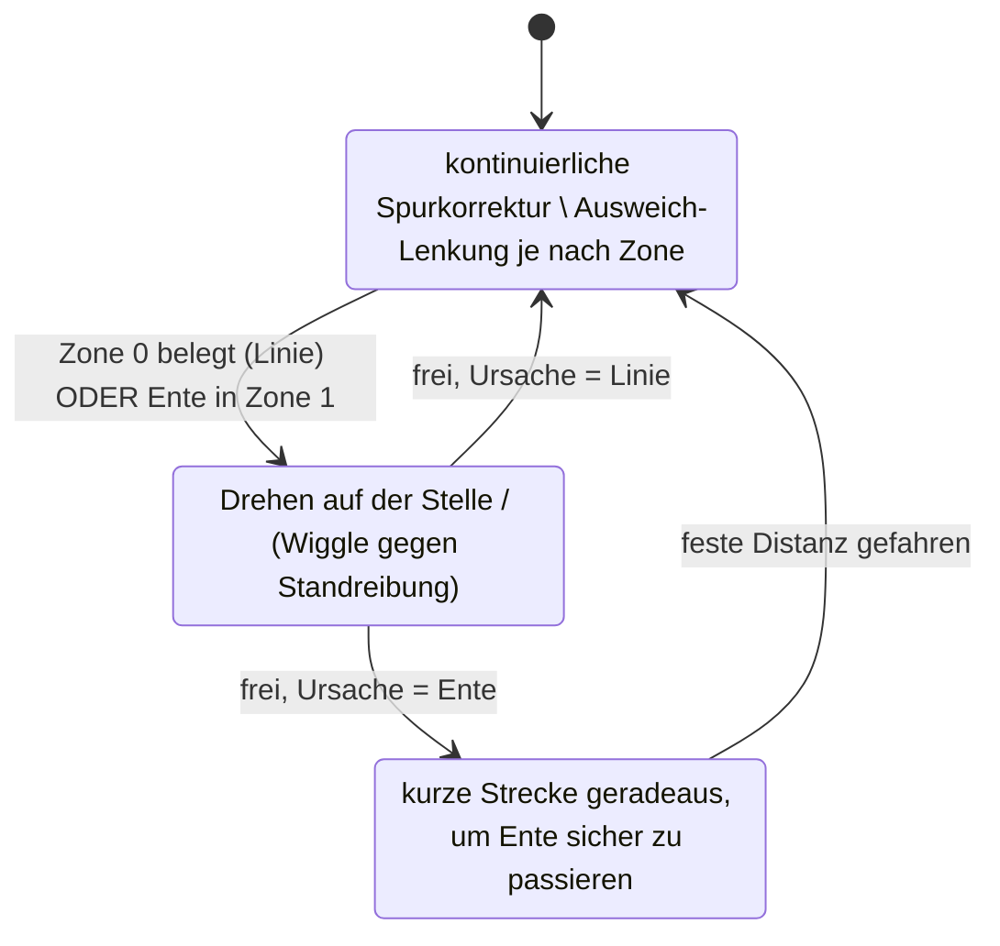
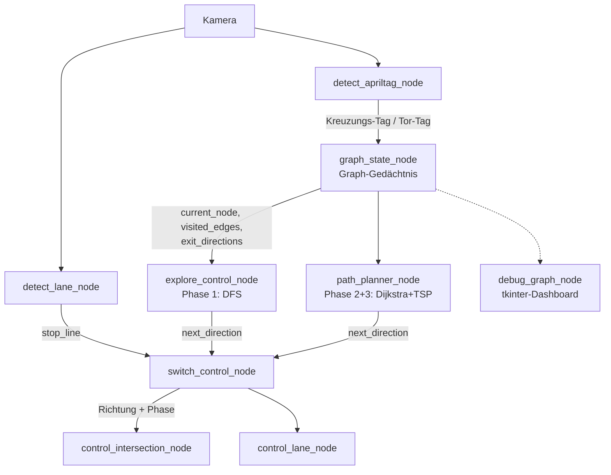
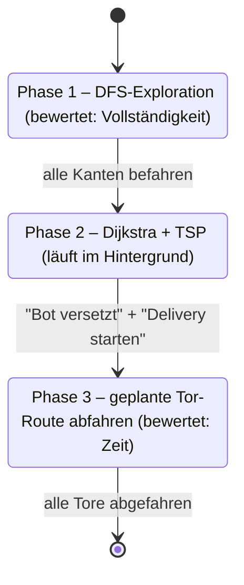

# DuckieRace 2026 – Projektbericht

**Fach:** Robogistic
**Team:** Gruppe 03 – Tomy, pixelouie & NaiRolF878
**Plattform:** Duckiebot, ROS 1 (Noetic), Ubuntu 20.04, Python 3, OpenCV
**Repository:** https://github.com/NaiRolF878/DuckieRace_2026_Gruppe03

---

## Inhaltsverzeichnis

1. [Einleitung und Systemüberblick](#1-einleitung-und-systemüberblick)
2. [Challenge 1 – Lane Following](#2-challenge-1--lane-following)
3. [Challenge 2 – Intersection Handling](#3-challenge-2--intersection-handling)
4. [Challenge 3 – Watch out for Ducks](#4-challenge-3--watch-out-for-ducks)
5. [Challenge 4 – Mapping & Path Finding](#5-challenge-4--mapping--path-finding)
6. [Programmlisting / Quellcode](#6-programmlisting--quellcode)
7. [Video](#7-video)
8. [Zusammenfassung und Ausblick](#8-zusammenfassung-und-ausblick)

---

## 1. Einleitung und Systemüberblick

Im Rahmen der Vorlesung *Robogistic* haben wir einen Duckiebot durch vier
aufeinander aufbauende Challenges autonom gemacht: erst Spurfolgen, dann
Kreuzungen befahren, Hindernissen ausweichen und zum Schluss eine unbekannte
Strecke selbst kartieren, darauf per AprilTag markierte Tore finden und diese
in einer definierten Reihenfolge durchfahren. Die komplette Software läuft
unter ROS 1 (Noetic) auf Ubuntu 20.04 in Python 3, organisiert als
Catkin-Workspace, in dem jede Challenge ein eigenes ROS-Package bildet
(`follow_lane`, `intersection_handling`, `avoid_ducks`/`ducks`, `mapping`).

Als Ausgangspunkt diente ein von der Veranstaltung bereitgestelltes
Vorlagen-Repository
(https://github.com/DuckieBotIRAS/DuckieRace_2026), das bereits die
Grundstruktur des Catkin-Workspace sowie Teile der Bildverarbeitung für
Challenge 1 mitbrachte – Bird's-Eye-View-Transformation und HSV-Farbmaskierung
in `detect_lane_node.py` waren dort schon funktionsfähig vorhanden. PID-Regler
und Haltelinien-Erkennung in Challenge 1 sowie alles ab Challenge 2 haben wir
selbst entwickelt.

### 1.1 Gemeinsame Grundarchitektur

Wir haben von Anfang an versucht, nicht für jede Challenge bei null
anzufangen, sondern ein Grundmuster mitzunehmen und schrittweise zu
erweitern:



Wahrnehmung (Kamera → Bird's-Eye-View → HSV-Farbfilter bzw.
AprilTag-Erkennung) und Regelung (PID-Spurregler, Motorbefehle) sind bei uns
konsequent getrennte Nodes. Jede neue Challenge kam mit einer zusätzlichen
Entscheidungsschicht dazu, ohne dass wir die darunterliegende
Wahrnehmung/Regelung noch einmal anfassen mussten: Challenge 2 brachte eine
Kreuzungs-FSM, Challenge 3 eine Ausweich-Zustandsmaschine, Challenge 4
schließlich eine komplette Graph-Schicht für Kartierung und Pfadplanung.

Alle Parameter – HSV-Schwellen, PID-Faktoren, Timeouts und so weiter – liegen
in JSON-Dateien und lassen sich über eine gemeinsame `configuration_node.py`
(eine tkinter-GUI mit Schiebereglern) live verändern, ohne dass wir die Nodes
neu starten müssen. Zusätzlich bringt jedes Package eine
`camera_dashboard_node.py` mit, die die wichtigsten Debug-Bilder und den
aktuellen Status in einem 2×2-Fenster zusammenfasst – gerade beim Kalibrieren
vor Ort war das enorm hilfreich.

Die folgenden vier Kapitel gehen jede Challenge einzeln nach demselben Schema
durch: Architektur, Schlüsselkomponenten, Zustands-/Ablaufdiagramme und
Schnittstellen.

---

## 2. Challenge 1 – Lane Following

### 2.1 Systemarchitektur

Ziel von Challenge 1 war robustes Spurfolgen: Der Bot hält sich zwischen der
gelben Mittellinie und der weißen Außenlinie und hält an roten Haltelinien
kurz an. Die Architektur besteht aus vier produktiven Nodes plus zwei
Hilfs-Nodes für Konfiguration und Visualisierung:



Die Detection-Seite ist zustandslos – jeder Frame wird unabhängig
verarbeitet –, während die Control-Seite als einzige Node Zustand hält
(PID-Integral, Haltelinien-Automat). Diese Trennung hat sich später
ausgezahlt: Spätere Challenges konnten wir auf der Entscheidungsebene
erweitern, ohne die Bildverarbeitung noch einmal anzufassen.

### 2.2 Schlüsselkomponenten

`detect_lane_node.py` ist das Herzstück der Wahrnehmung und läuft komplett in
einer Node – ein Bild-Decode und eine Perspektivtransformation pro Frame
reichen, statt das auf mehrere Nodes zu verteilen und Rechenzeit auf dem Bot
zu verschwenden. Die BEV-Transformation und die HSV-Farbmaskierung (Punkte 1
und 2) waren bereits im Vorlagen-Repository der Veranstaltung funktionsfähig
enthalten; die rote Haltelinie (Punkt 5) haben wir selbst ergänzt:

1. **Bird's-Eye-View (BEV):** Das Kamerabild wird per
   `cv2.getPerspectiveTransform`/`warpPerspective` in eine 400×400-Pixel
   Draufsicht auf die Fahrbahn transformiert. Die vier Eckpunkte des Trapezes
   sind über die Konfiguration kalibrierbar.
2. **HSV-Farbmasken** für Gelb und Weiß, anschließend eine morphologische
   Schließung (`MORPH_CLOSE`), damit durch Schatten entstandene Lücken in der
   Maske verschwinden.
3. **Sobel-Kantenerkennung** in x-Richtung bestimmt die Linienposition. Ist
   die letzte bekannte Position schon bekannt (`last_known`), wählen wir die
   Kante, die dieser am nächsten liegt – das macht die Erkennung in engen
   Kurven robuster, weil sie nicht versehentlich auf die Gegenspur springt.
4. **Frame-Tracking:** Springt die erkannte Position zwischen zwei Frames zu
   stark (`max_frame_jump`), behalten wir die alte Position, statt der
   fehlerhaften Momentaufnahme zu vertrauen.
5. **Rote Haltelinie (von uns ergänzt):** Zwei HSV-Bereiche decken den roten
   Farbton ab (Rot liegt an zwei gegenüberliegenden Stellen des Hue-Kreises),
   ausgewertet in einer ROI im unteren Bilddrittel.

`control_lane_node.py` ist die einzige Node, die tatsächlich Fahrbefehle
sendet. Den PID-Regler, der aus dem Spurversatz `error ∈ [-1, +1]` die
Lenkung berechnet, haben wir selbst geschrieben:

```
P = kp · error
I = ki · Σ(error · dt)         (mit Anti-Windup-Clamp)
D = kd · (error − letzter_error) / dt
omega = clamp(P + I + D, −3, +3)
v = MAX_VEL · max(MIN_VEL_FACTOR, 1 − |error| · Kurvenfaktor)
```

Die Geschwindigkeit sinkt damit automatisch mit wachsendem Spurfehler, der
Bot fährt in Kurven langsamer, bleibt aber durch eine Mindestgeschwindigkeit
nie ganz stehen.

`switch_control_node.py` ist in Challenge 1 noch ein minimaler Platzhalter,
der dauerhaft `/enable/lane = True` publiziert. Wir haben ihn absichtlich so
angelegt, dass er sich in Challenge 2 zu einer echten Zustandsmaschine
ausbauen lässt, ohne die Topic-Schnittstelle zu ändern.

### 2.3 Zustandsdiagramm: Haltelinien-Automat

Der einzige nennenswerte Zustand des Systems in Challenge 1 ist der
Haltelinien-Automat in `control_lane_node.py`:



Der Cooldown-Zustand verhindert, dass der Bot direkt nach dem Anfahren an
derselben, noch sichtbaren Haltelinie sofort wieder anhält.

### 2.4 Schnittstellen

| Topic | Typ | Richtung |
|---|---|---|
| `camera_node/image/compressed` | `CompressedImage` | Kamera → detect_lane |
| `detect/lane` | `Float64` | detect_lane → control_lane |
| `detect/stop_line` | `Bool` | detect_lane → control_lane |
| `enable/lane` | `Bool` | switch_control → control_lane |
| `car_cmd_switch_node/cmd` | `Twist2DStamped` | control_lane → Motoren |
| `debug/original`, `debug/annotated`, `debug/lane_white`, `debug/lane_yellow`, `debug/lane_red` | `CompressedImage` | detect_lane → Dashboard |

---

## 3. Challenge 2 – Intersection Handling

### 3.1 Systemarchitektur

Challenge 2 baut direkt auf Challenge 1 auf: Spurerkennung und PID-Regelung
bleiben unverändert, dazu kommt die Fähigkeit, Kreuzungen zu erkennen, per
AprilTag die erlaubten Richtungen zu bestimmen, zufällig eine davon zu wählen
und abzubiegen. Wir haben uns dabei am Zwei-Schichten-Prinzip der
offiziellen Duckietown-Pipeline orientiert:

- Die rote Haltelinie ist der Trigger – sie sagt *wann* angehalten wird.
- Der AprilTag liefert die Richtung – er sagt *welche* Abbiegungen erlaubt
  sind.
- Eine zentrale Zustandsmaschine (`switch_control_node.py`) führt beide
  Signale zusammen und entscheidet, *was* der Bot macht.



Eine Kreuzung löst nur aus, wenn rote Linie und eine bekannte
Tag-Richtung gleichzeitig vorliegen; eine rote Linie ohne Tag ignoriert das
System komplett (der Bot fährt einfach weiter) – ein sicheres Default, falls
der Tag z.B. mal nicht erkannt wird.

### 3.2 Schlüsselkomponenten

`detect_apriltag_node.py` erkennt die Kreuzungs-Tags (IDs 1–4) über die
Bibliothek `pupil_apriltags`. Jede Tag-ID ist über die Konfiguration auf eine
Liste erlaubter Richtungen (`left`/`right`/`straight`) abgebildet. Ein
Tag-Gedächtnis merkt sich einen zuletzt gesehenen, nahen Tag für einige
Sekunden – Tag und Haltelinie sind in der Praxis nämlich selten gleichzeitig
im Bild sichtbar, weil die Haltelinie unten im Bild liegt und der Tag oft
seitlich daneben.

`switch_control_node.py` ist die einzige Node mit echter Zustandslogik. Sie
schaltet zwischen den Steuerungs-Nodes um (`enable/lane`,
`enable/intersection`) und würfelt beim Eintritt in die Kreuzung per
`random.choice()` eine der erlaubten Richtungen aus.

`control_intersection_node.py` fährt die eigentliche Abbiegung: eine
zeitbasierte Segment-Sequenz (`v`, `omega`, `duration`) pro Richtung, die der
Reihe nach abgefahren wird – zum Beispiel kurz geradeaus in die Kreuzung,
hart einlenken, kurz geradeaus wieder heraus. Der Start der Sequenz ist
ereignisgesteuert über ein eigenes Topic `/intersection/turn_start`, das
Richtung und Startzeitpunkt atomar in einer Nachricht bündelt. Das war uns
wichtig, weil bei zwei unabhängigen Topics ohne garantierte Reihenfolge eine
Race Condition entstehen kann – ein Phasenwechsel könnte ankommen, bevor die
zugehörige Richtung aktualisiert ist.

### 3.3 Zustandsdiagramm



Der `turning_timeout` dient als Sicherheitsnetz, falls das `turn_done`-Signal
aus irgendeinem Grund nie eintrifft, damit der Bot nicht dauerhaft in
`Turning` hängen bleibt.

### 3.4 Schnittstellen

| Topic | Typ | Richtung |
|---|---|---|
| `detect/apriltag/direction` | `String` | detect_apriltag → switch_control |
| `detect/apriltag/id` | `Int32` | detect_apriltag → Dashboard |
| `intersection/phase` | `String` | switch_control → control_intersection, Dashboard |
| `intersection/direction` | `String` | switch_control → control_intersection, Dashboard |
| `intersection/turn_done` | `Bool` | control_intersection → switch_control |
| `enable/lane`, `enable/intersection` | `Bool` | switch_control → control_lane / control_intersection |
| `car_cmd_switch_node/cmd` | `Twist2DStamped` | control_lane / control_intersection → Motoren |

---

## 4. Challenge 3 – Watch out for Ducks

### 4.1 Systemarchitektur

In Challenge 3 befährt der Bot einen Wendeplatz mit statischen Hindernissen
("Enten") und muss ihnen ausweichen, ohne sie zu berühren oder die Fahrbahn
zu verlassen. Als produktive Lösung haben wir uns für das Package
`avoid_ducks` entschieden – das Grundgerüst (Homographie-Zonenmodell,
YOLO-Integration, Zustandsautomat) stammt ursprünglich von einem anderen
Team, wir haben es für unser Projekt übernommen und weiterentwickelt. Anders
als in den übrigen Challenges steckt hier die komplette Logik aus Spurfolgen
und Hinderniserkennung in **einer einzigen Node**
(`duck_avoidance_node.py`), statt auf mehrere Nodes verteilt zu sein:



Wir projizieren das Kamerabild mithilfe von Kamera-Intrinsics und einer
vorab kalibrierten Homographie in eine reale Bodenebene – dadurch lassen
sich Distanzen zu Hindernissen in echten Zentimetern statt in Bildpixeln
auswerten. Die Fahrbahn direkt vor dem Bot ist in drei trapezförmige Zonen
unterteilt (Zone 0 sehr nah, Zone 1 mittel, Zone 2 fern).

### 4.2 Schlüsselkomponenten

`detect_ducks_node.py` führt ein trainiertes YOLO-Modell (Ultralytics,
ONNX-Export) auf dem entzerrten Kamerabild aus und liefert die
Bounding-Boxen erkannter Enten als `Polygon`-Nachricht. Ein Tiefen-Filter
(`y_threshold`) verwirft Erkennungen am Horizont, weil die für die
unmittelbare Fahrentscheidung ohnehin irrelevant sind.

`duck_avoidance_node.py` ist der zentrale Regler und vereint mehrere Dinge:

- **Wahrnehmung:** HSV-Masken für die weiße Außen- und gelbe Mittellinie,
  ausgewertet innerhalb der drei projizierten Zonen. Eingehende
  Enten-Bounding-Boxen werden dabei aus der Linien-Maske "ausgestanzt",
  damit eine Ente auf der Mittellinie nicht fälschlich als Linie gezählt
  wird.
- **Positions-Gedächtnis:** Das YOLO-Modell erkennt nicht in jedem Frame
  etwas, deshalb matchen wir Enten-Bounding-Boxen anhand ihres Bildabstands
  zwischen Frames und halten sie kurz "am Leben", auch wenn sie in einem
  Frame mal ausbleiben – sonst würde die Zonen-Belegung flackern.
- **Reaktive Regelung:** Alle Parameter (Wiggle-Stärke, Dreh-Geschwindigkeit,
  Dauer des Enten-Gedächtnisses, …) laden wir live aus einer
  JSON-Konfiguration, statt sie fest im Code zu hinterlegen.
- **Debug-Overlay:** Das Live-Debug-Fenster zeigt die tatsächliche
  FSM-Aktion in Klartext ("Freie Fahrt", "Spurkorrektur", "Weiche aus wegen
  Ente (rechts)", "Fahre an Ente vorbei") statt der rohen Motorbefehle – das
  hat uns beim Debuggen vor Ort viel Zeit gespart.

### 4.3 Zustandsdiagramm



Die Ausweichrichtung wird beim Eintritt in `ROTATING` einmalig bestimmt (aus
der Position der Ente relativ zur Bildmitte bzw. aus der belegten
Linienfarbe) und über einen periodischen Inversions-Check abgesichert: Würde
die gewählte Drehrichtung mitten im Manöver auf eine neue Blockade zulaufen,
kehrt sie sich um.

Im parallel entwickelten Package `ducks` (ein eigener, reiner
Farbfilter-Ansatz ohne neuronales Netz) hatten wir ursprünglich eine deutlich
komplexere sechsstufige Ausweich-Zustandsmaschine inklusive
Encoder-basierter Rückkehr-Odometrie gebaut. Die haben wir im Projektverlauf
nach dem Vorbild von `avoid_ducks` auf drei Zustände vereinfacht – mehr dazu
in Kapitel 8.

### 4.4 Schnittstellen

| Topic | Typ | Richtung |
|---|---|---|
| `detect/duck_obstacles` | `Polygon` | detect_ducks → duck_avoidance |
| `debug/duck_detection` | `CompressedImage` | detect_ducks → Dashboard |
| `debug/avoidance_view/compressed` | `CompressedImage` | duck_avoidance → Dashboard |
| `car_cmd_switch_node/cmd` | `Twist2DStamped` | duck_avoidance → Motoren |
| `left_wheel_encoder_node/tick`, `right_wheel_encoder_node/tick` | `WheelEncoderStamped` | Bot → duck_avoidance (Odometrie) |

---

## 5. Challenge 4 – Mapping & Path Finding

### 5.1 Systemarchitektur

Challenge 4 war für uns die letzte und umfangreichste Stufe: Der Bot bekommt
einen Stadtgraphen als JSON, muss ihn selbstständig per Tiefensuche (DFS)
vollständig abfahren und dabei per AprilTag markierte Tore auf den Kanten
finden. Anschließend muss er diese Tore in einer definierten Reihenfolge
durchfahren – entweder fest vorgegeben durch die Challenge (als `gate_order`
einprogrammiert) oder, falls keine Vorgabe existiert, von uns selbst
optimiert (kürzeste Gesamtroute per TSP, dem Traveling-Salesman-Problem).
Das Package baut auf `intersection_handling` auf: Spurerkennung,
PID-Regelung und die Kreuzungs-Segmentfahrt haben wir in ihrer
Grundstruktur übernommen und um eine komplette Graph-Schicht ergänzt:



`graph_state_node` ist unser zentrales Gedächtnis: Es weiß, wo der Bot
gerade ist, welche Kanten schon befahren wurden und wo die Tore liegen.
`explore_control_node` und `path_planner_node` sind die zwei "Gehirne" für
Phase 1 bzw. Phase 2/3 – sie entscheiden, wohin der Bot als Nächstes soll,
und übersetzen das über `graph_state_node` in eine Wort-Richtung
(`left`/`right`/`straight`) für die unveränderte Challenge-2-FSM.
`debug_graph_node` macht den gesamten Prozess sichtbar und ist der einzige
Ort, an dem wir manuell eingreifen.

### 5.2 Schlüsselkomponenten

**Graph-Format:** Unser Stadtgraph ist ungerichtet und symmetrisch; jede
Kreuzung hat bis zu vier Ausfahrten (Tags 1–4, physikalisch fest: 1 und 3
liegen sich gegenüber, 2 ist rechts von 1, 4 links von 1):

```json
"A": { "1": ["B", "1"], "2": ["C", "2"], "3": ["C", "1"], "4": ["B", "2"] }
```

`"2": ["C", "2"]` bedeutet: An Kreuzung A, Ausfahrt Tag 2 gewählt, führt die
Kante zu Knoten C, wo der Bot über dessen Tag 2 ankommt. Kreuzungs-Tags
(1–4) codieren die Einmündung, Tor-Tags (5–13) codieren die Zielorte
("Tore") auf den Kanten dazwischen.

`graph_state_node.py` verwaltet `current_node`, `visited_edges` und
`gate_map` und übersetzt bei jedem Tick den aktuell bekannten Einfahrt-Tag in
die für jede mögliche Ausfahrt passende Wort-Richtung. Es verfolgt außerdem
einen vorhergesagten Einfahrt-Tag (`predicted_entry_tag`), der bereits bei
der vorherigen Abbiegeentscheidung feststeht, lange bevor die Kamera an der
neuen Kreuzung überhaupt etwas sehen muss. Wir haben uns bewusst dafür
entschieden, dieser Vorhersage mehr zu vertrauen als der Live-Kamera-Ablesung
– die Graph-Topologie hatten wir von Hand gegen die echte Strecke geprüft,
während sich Kamerafehlablesungen in unseren Tests als das größere Risiko
erwiesen. Weil die Karte in der Praxis zu groß ist, um Kartierung und
Tor-Durchfahrt in einem durchgehenden Lauf abzuschließen, unterstützt die
Node außerdem ein `mapping_required`-Flag: Ist eine frühere Erkundung bereits
nachweislich vollständig, können wir den Software-Stack neu starten, ohne
die komplette Strecke erneut abzufahren.

`explore_control_node.py` wählt in Phase 1 an jeder Kreuzung die erste noch
unbesuchte Ausfahrt (Tiefensuche). Sind alle Ausgänge eines Knotens besucht,
sucht eine Breitensuche über den vollständigen Graphen (nicht nur bereits
befahrene Kanten) den nächsten Knoten mit unbesuchten Ausgängen.

`path_planner_node.py` plant in Phase 2/3 die Reihenfolge aller gefundenen
Tore mit einer eigenen Dijkstra-Implementierung. Ist keine feste Reihenfolge
vorgegeben, optimieren wir sie selbst – per Brute-Force bei bis zu zehn
Toren, sonst per Greedy-Heuristik. Als Kantengewicht dient dabei nicht die
Anzahl Abbiegungen, sondern die tatsächlich gemessene Fahrzeit je Kante
(`/graph/edge_durations`), damit die "kürzeste" Route auch wirklich die
schnellste ist.

`debug_graph_node.py` visualisiert die Karte live (befahrene Kanten grün,
geplante Tor-Route blau gestrichelt, Bot-Position gelb) und enthält die
einzigen manuellen Eingriffspunkte: den Start-Button sowie Buttons für
Notfall-Korrekturen und die Bestätigung "Bot versetzt". Letztere brauchten
wir, weil wir den Bot zwischen Erkundung und Tor-Durchfahrt bewusst von Hand
neu positionieren, um bei der Erkundung eine vollständige eulersche
Kantentour sicherzustellen – die Software bekommt diese Neupositionierung
sonst nicht mit.

### 5.3 Zustandsdiagramm: Die drei Phasen



("Delivery" ist hier nur der intern verwendete Phasenname aus dem Code – es
werden keine Objekte transportiert, sondern die Tore in der festgelegten
Reihenfolge angefahren.)

Den Übergang von Phase 1 zu Phase 3 lösen wir ausschließlich manuell im
Debug-Fenster aus – die Planung selbst (Phase 2) läuft bereits im
Hintergrund, sobald die Erkundung fertig ist, damit wir die geplante Route
vor dem Startknopf-Druck noch prüfen können.

### 5.4 Schnittstellen

| Topic | Typ | Richtung |
|---|---|---|
| `graph/current_node`, `graph/visited_edges`, `graph/gate_map` | `String` (z.T. JSON) | graph_state → explore, path_planner, Dashboard |
| `graph/exit_directions`, `graph/allowed_directions` | `String` | graph_state → explore, path_planner, switch_control |
| `graph/edge_durations` | `String` (JSON) | graph_state → path_planner (Dijkstra-Kantengewichte) |
| `graph/bot_relocated`, `graph/reset_exploration`, `graph/reload_gate_map` | `Bool` | Dashboard (Buttons) → graph_state |
| `navigation/next_direction` | `String` | explore / path_planner → switch_control |
| `navigation/exploration_done`, `navigation/delivery_done` | `Bool` | explore / path_planner → Dashboard |
| `navigation/start_delivery` | `Bool` | Dashboard → path_planner |
| `intersection/turn_start` | `String` | switch_control → control_intersection, graph_state |

---

## 6. Programmlisting / Quellcode

Den vollständigen Quellcode findet man im Git-Repository des Projekts
(https://github.com/NaiRolF878/DuckieRace_2026_Gruppe03,
`src/packages/<paketname>/src/`). Als Beispiel für unseren
durchgängigen Programmierstil zeigt der folgende Ausschnitt den PID-Regler
aus `control_lane_node.py` (Challenge 1), den wir in allen Challenges in
gleicher oder leicht erweiterter Form wiederverwenden:

```python
def cbFollowLane(self, msg):
    error = max(min(msg.data, 2.0), -2.0)          # Übersteuerung begrenzen

    P = self.kp * error
    self.integral += error * self.dt
    self.integral = max(min(self.integral, self.INTEGRAL_LIMIT),
                         -self.INTEGRAL_LIMIT)       # Anti-Windup
    I = self.ki * self.integral
    D = self.kd * (error - self.lastError) / self.dt

    self.a = max(min(P + I + D, 3), -3)              # Lenkung
    self.v = max(self.MIN_VEL, self.MAX_VEL * (1 - abs(error)))
    self.lastError = error
```

Ein zweites Beispiel, die Kern-Entscheidung der Graphsuche in
`explore_control_node.py` (Challenge 4), zeigt, wie die Tiefensuche über den
Stadtgraphen läuft:

```python
def _decide_next_exit(self):
    actionable = self._first_actionable_exit(self.current_node)
    if actionable is not None:
        return actionable
    path_tags = self._find_backtrack_path(self.current_node)
    return path_tags[0] if path_tags else None
```

---

## 7. Video

Uns liegt für diesen Bericht leider kein Video mehr vor, das den Ablauf der
vier Challenges zeigt. Ursprünglich geplant war eine kurze Zusammenstellung
mit einem Ausschnitt aus jeder Challenge:

1. **Challenge 1 (ca. 30 s):** Bot folgt der Spur über mehrere Kurven,
   Anhalten an einer roten Haltelinie.
2. **Challenge 2 (ca. 45 s):** Anfahrt auf eine Kreuzung, Erkennung des
   AprilTags, Abbiegevorgang.
3. **Challenge 3 (ca. 45 s):** Anfahrt auf eine Ente, Ausweichmanöver,
   Rückkehr auf die Spur – idealerweise inklusive kurzem Blick auf das
   Debug-Dashboard (Zonen-Overlay).
4. **Challenge 4 (ca. 90 s):** Ausschnitt aus der autonomen Erkundung, das Debug-Dashboard mit wachsender grüner Karte, der Knopfdruck "Bot versetzt"/"Delivery starten" und die anschließende Fahrt durch die Tore in der festgelegten Reihenfolge.

---

## 8. Zusammenfassung und Ausblick

### 8.1 Zusammenfassung

Über die vier Challenges hinweg haben wir ein durchgängiges,
wiederverwendbares Software-Grundgerüst gebaut: strikt getrennte
Wahrnehmungs- und Regelungs-Nodes, JSON-basierte Live-Konfiguration und ein
einheitliches Debug-Dashboard-Konzept. Jede neue Challenge hat gezielt eine
zusätzliche Entscheidungsschicht bekommen (Kreuzungs-FSM, Ausweich-Logik,
Graph-/Pfadplanungs-Logik), ohne dass wir die darunterliegende, bereits
erprobte Wahrnehmungs- und PID-Regelungsebene noch einmal grundlegend
anfassen mussten. Diese Entscheidung hat sich ausgezahlt: Challenge 4 nutzt
zum Beispiel dieselbe Kreuzungs-Segmentfahrt wie Challenge 2 unverändert
weiter.

Ein paar Design-Entscheidungen, auf die wir im Projektverlauf gekommen sind:

- In Challenge 4 haben wir uns entschieden, der aus der (von Hand geprüften)
  Graph-Topologie vorhergesagten Position mehr zu vertrauen als der
  Live-Kamera-Ablesung, nachdem sich Letzteres in der Praxis als
  fehleranfälliger herausgestellt hat.
- In Challenge 3 haben wir zwei unabhängig entwickelte Lösungen verglichen –
  `avoid_ducks` (farbbasiert mit Homographie-Zonen plus YOLO) und `ducks`
  (ein reiner Farbfilter-Ansatz) – und uns für `avoid_ducks` als produktive
  Lösung entschieden. Die ursprünglich sechsstufige Ausweich-Zustandsmaschine
  von `ducks`, inklusive Encoder-basierter Rückkehr-Odometrie, erwies sich
  als fehleranfällig: Encoder-Ticks zählten auch beim Drehen auf der Stelle
  mit und lieferten damit kein verlässliches Maß für die tatsächliche
  seitliche Auslenkung. Wir haben sie daraufhin nach dem Vorbild von
  `avoid_ducks` auf drei Zustände vereinfacht (Normalbetrieb mit
  kontinuierlichem Ausweich-Offset, Notfall-Drehung, feste kurze
  Rückkehr-Geradeausfahrt).
- Bei der Abbiege-Segmentfahrt hatten wir in Challenge 2 anfangs einen
  encoder-basierten Ansatz ausprobiert (Abbiegen bis eine feste Anzahl
  Radticks erreicht ist), der uns aber nicht überzeugt hat – zu ungleichmäßig
  je nach Bodenhaftung und Akkustand. Ebenfalls ausprobiert haben wir ein
  Abbruchkriterium anhand der roten Haltelinie der Gegenspur im Kamerabild,
  bekamen das aber nicht stabil zum Laufen. Wir sind deshalb auf eine
  zeitbasierte Segmentfahrt (`v`/`omega`/`duration`) umgestiegen und haben
  die unverändert bis in Challenge 4 übernommen.

Uns hat das Projekt insgesamt sehr gut gefallen, und wir nehmen einiges
daraus mit – als praktische Ergänzung, teils sogar Alternative zur normalen
Vorlesung würden wir das jederzeit wieder machen. Ohne Unterstützung durch
KI-Tools wäre das für uns so nicht machbar gewesen, da bei uns zu Beginn schlicht keine Programmiererfahrung vorhanden war. 
Erschwert hat die Arbeit außerdem eine teils unzuverlässige Hardware der
Bots: Bei einigen lief der Motor schwer, die Kamera reagiert sehr
empfindlich auf Lichtverhältnisse, und eigentlich hätten alle Bots ein IMU
haben sollen – funktioniert hat das aber nur bei vier. Dadurch war oft
nicht sofort klar, ob ein Fehler im eigenen Code lag oder an der Hardware,
was das Debuggen mehr als einmal unnötig in die Länge gezogen hat.

Hilfreich wäre außerdem eine kurze ROS-Einführung vor dem eigentlichen Start
gewesen, ebenso ein Einblick in deliberative Trajektorienplanung (z.B.
Spline-Optimierung mit Kollisionskosten), reaktive Hindernisvermeidung
(Potentialfeld-/Dynamic-Window-artig), Odometrie sowie FSM, Behavior Trees
und Subsumption-Architektur oder andere Konzepte, die für die Challenges
hilfreich gewesen wären – um von Anfang an auf mehr und kreativere Ideen zu
kommen, statt sich (wie bei uns teilweise passiert) auf den erstbesten
funktionierenden Ansatz festzulegen.

### 8.2 Ausblick

Aus den "Bekannte Einschränkungen"-Abschnitten der einzelnen Packages
ergeben sich für uns konkrete Ansatzpunkte für eine Weiterentwicklung:

- **Orthogonal-Ausrichtung an Kreuzungen:** Kommt der Bot leicht schräg an
  einer Haltelinie an, überträgt sich das auf die gesamte folgende
  Abbiegung. Eine Vorab-Korrektur anhand der erkannten Neigung der roten
  Linie im Kamerabild würde das eventuell beheben.
- **Andere Herangehensweisen/Konzepte testen:** Es wäre spannend gewesen,
  bewusst auch ganz andere Lösungsansätze auszuprobieren statt beim ersten
  funktionierenden zu bleiben. Ein Beispiel aus einer anderen Gruppe: Statt
  Enten wie bei uns laufend während der Fahrt per YOLO zu erkennen, hat sie
  den Wendeplatz vor der eigentlichen Fahrt einmal mit einer kalibrierten
  Kamera fotografiert und die Enten-Positionen direkt aus diesem
  Übersichtsbild bestimmt. Das gegen unsere Live-Erkennung zu vergleichen
  wäre interessant gewesen – vermutlich robuster gegen kurzzeitige
  Verdeckungen und Beleuchtungswechsel während der Fahrt, dafür aber darauf
  angewiesen, dass sich an den Enten-Positionen nach dem Foto nichts mehr
  ändert.
- **Feingranularere Persistierung der Kartierung:** Unser
  `mapping_required`-Flag kennt nur "alles bereits vollständig kartiert"
  oder "nichts kartiert". Wird während der Erkundung ein Knoten falsch
  gemappt, bleibt aktuell nur der Reset-Button im Dashboard, der die
  komplette Kartierung verwirft und wieder bei null anfängt. Würden wir
  jede einzelne befahrene Kante laufend mitspeichern (statt wie aktuell nur
  `gate_map` und `edge_durations`), könnte man nach einem Kartierungsfehler
  gezielt nur den betroffenen Teil korrigieren und die Erkundung fortsetzen,
  statt komplett neu zu starten.
